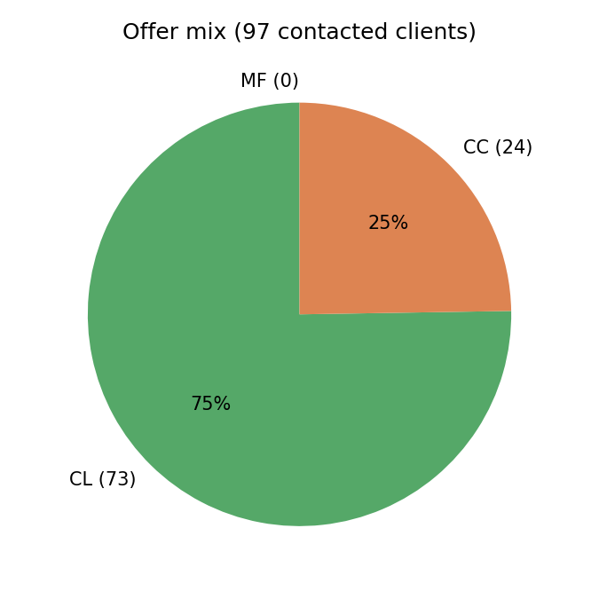
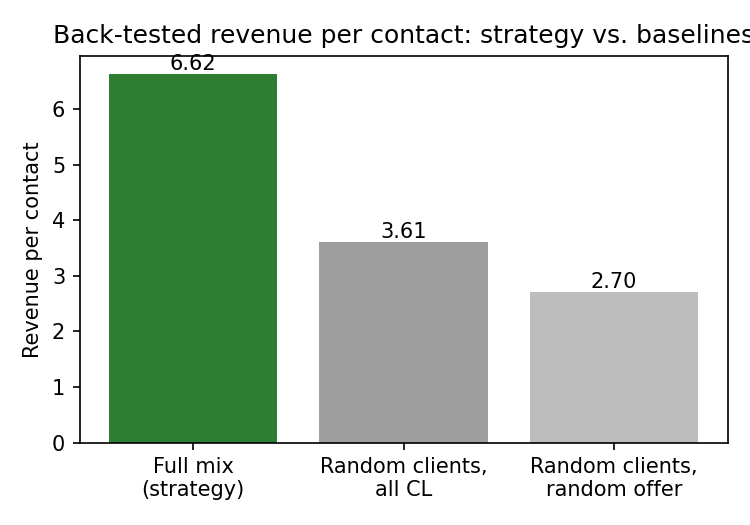
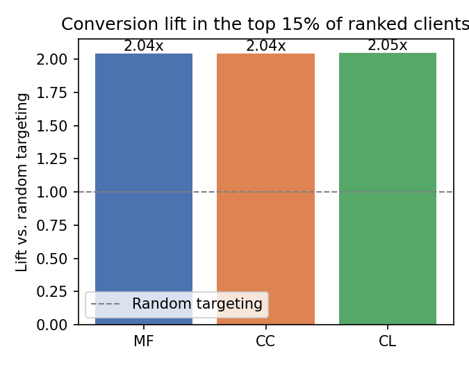

# Executive Summary Direct Marketing Optimization

## Objective
Identify which of the bank's clients are most likely to buy a consumer loan, credit card, or mutual fund, and select the 97 clients (15% of the unlabelled client base) to contact in order to maximize expected campaign revenue.

## Approach
Three propensity models were built (one per product) using socio-demographic, product-holding, and account-activity data for the 969 clients (60%) with known outcomes. Each model blends a logistic regression with a gradient boosting model (HGB). For each client, propensity was combined with the average revenue earned from past buyers of each product to compute an expected revenue per offer. Clients were then ranked by their single best offer, and the top 97 were selected. The strategy was validated with a held-out back-test on the labeled data before being applied to the 646 unlabelled clients.

## Who is targeted, and with what
| Offer | Contacts | Typical profile | Existing holders |
|---|---|---|---|
| **Consumer loan (CL)** | 73 | Young, long-tenured, active* | 14% |
| **Credit card (CC)** | 24 | Established, savings-account holders w/ high balances | 0% |
| **Mutual fund (MF)** | 0 | Best prospects show high turnover, but revenue too low for a slot and existing holders| — |

*(age 26 compared to 40; tenure 160 compared to 102 months) 

{width=25%}

## Why no mutual fund offers
Mutual funds have real propensity signal (the best MF prospects score up to 59% likely to buy), but MF's average revenue per buyer is lower than the other two products, so it never wins a contact slot under a 97-client budget. If contact capacity increases, MF becomes the next offer to add, as the full ranked list (`all_targeting_clients_scored.csv`) shows exactly which clients that would be.

## Expected revenue
- **Projected revenue from the 97 contacts: approx. 640 (range 530–790)**, based on a back-test that applied the identical strategy to the held-out labeled data and measured realized (not just predicted) revenue
- This is **1.8× the revenue of contacting the same 97 clients with a single, undifferentiated consumer-loan offer** (approx.350), which its used as the baseline for the model added value
- A simpler, consumer-loan-only strategy scores slightly higher in the back-test (approx. 770), but the gap is within statistical noise and driven by a small number of high-value credit-card buyers, it is reported here as a lower-variance alternative

{width=35%}

*Figure 2: At the same 97 contacts, the optimized strategy outperforms a single blanket consumer-loan offer by 1.8x (6.62 / 3.61 = 1.83× ≈ "1.8×") and unguided random targeting by roughly 2.5x (6.62 / 2.70 = 2.45× ≈ "2.5×")*

## Model quality
The three propensity models achieve moderate but real discrimination (AUC 0.60–0.65), at top 15% of ranked clients convert at ≈2.0× the base rate. This is consistent with dummy data of this size, as the value of the strategy comes primarily from concentrating contacts among the highest-scoring clients, not from any single feature dominating the prediction

{width=30%}

*Figure 3: Clients ranked in the top 15% by each model convert at 2.0x the base rate, confirming the models concentrate value where the campaign will act.*

## Key assumptions and risks
- Historical sale outcomes are treated as a proxy for how clients would respond to this campaign; no control group is available in the data to measure true causal uplift
- Revenue estimates rely on the average revenue of past buyers, which is heavy-tailed for credit cards (54% of CC revenue comes from the top 5% of buyers), this is the main source of uncertainty in the revenue projection
- The back-test is mildly optimistic, since the modeling choices were made on the same data it was validated

## Recommendation
Launch the campaign with a small randomized holdout (10% of the selected 97) that receives no offer. This directly measures incremental uplift and removes the largest assumption underlying this analysis for future campaigns.

*Prepared by Alejandro Gonzalez, September 2026, for the KBC Data Scientist case study.*