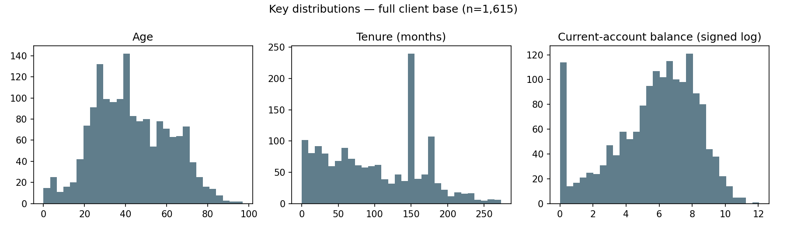
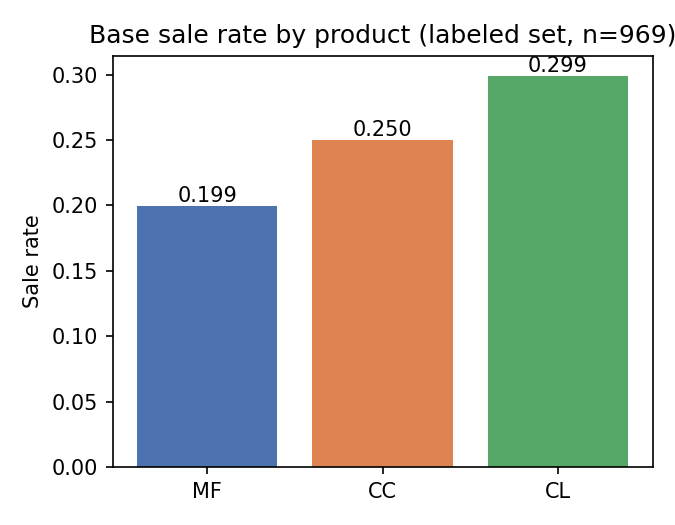
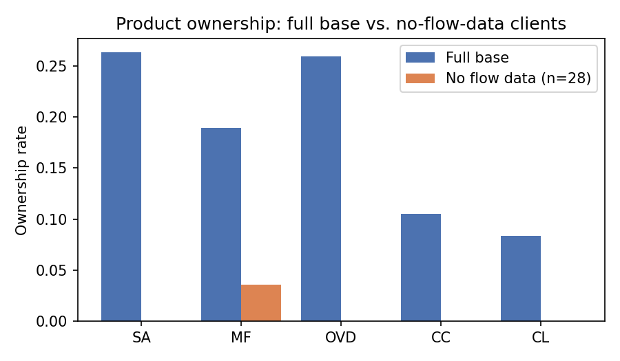
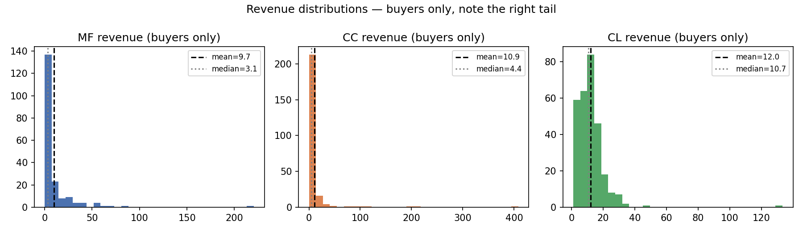
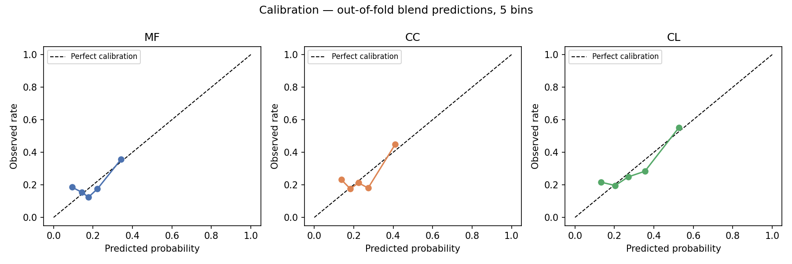
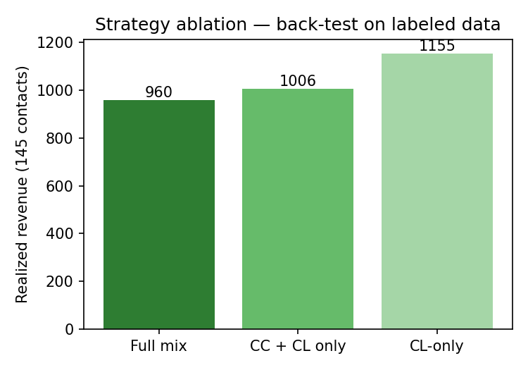
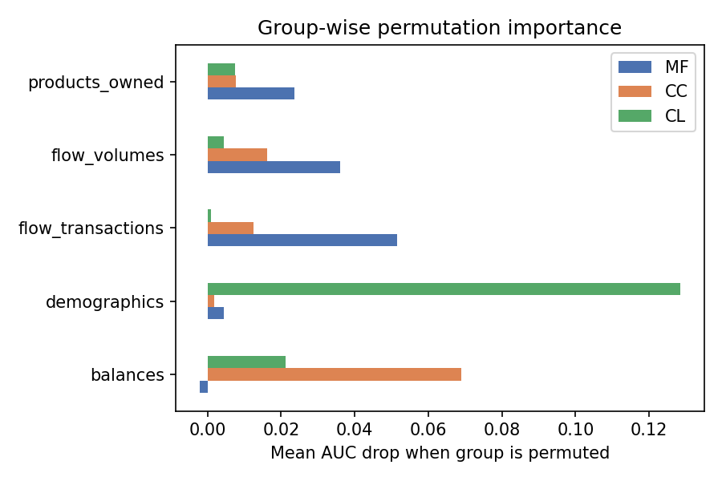

# Technical Report Direct Marketing Optimization

## 1. Task and data
The bank can contact 15% of its client base with one of three offers, consumer loan (CL), credit card (CC), or mutual fund (MF), and wants to maximize expected revenue. Outcomes (`Sale_*`, `Revenue_*`) are known for 969 of 1,615 clients (60%, the **labeled set**); the remaining 646 (40%, the **targeting set**) are unlabeled and are the clients we select contacts from.

Four source tables were joined on `Client`: socio-demographics, product holdings and balances, inflow/outflow (flows), and sales/revenues (labeled clients only).

{width=50%}


{width=35%}


## 2. Data quality and missing values

| Table | Missingness | Diagnosis | Treatment |
|---|---|---|---|
| Products (`Count_*`, `ActBal_*`) | NaN where a product isn't held | Structural, not missing data | Filled with 0; added `has_SA/MF/OVD/CC/CL` ownership flags |
| Soc_Dem `Sex` | 3 of 1,615 | Negligible | Kept as a distinct "UNK" category |
| Flows | 28 of 1,615 clients absent | Investigated (below) | Filled with 0; added `no_flow_data` flag |
| Targets | 646 of 1,615 clients (40%) | By design as this is the targeting set | N/A |

**Flow imputation (investigation)** The 28 clients without flow records were compared against the rest on demographics, product ownership, and (weakly, given only 18 labeled) sale rates:

- Demographics were similar (median age 46 vs. 41, tenure 108 vs. 96 months, current-account balance €407 vs. €465), not indicative of a data extraction gap.
- Product ownership was starkly different: **0% held a savings account, overdraft, credit card, or consumer loan**, versus 26–27% (SA, OVD) and 8–11% (CC, CL) in the rest of the base. Under a null hypothesis of no difference, this pattern has roughly a 1-in-5,000 probability by chance.
- Sale rates among the 18 labeled clients in this group were lower for MF (0/18) and CL (1/18) than the base rates (~20%, ~30%), though the sample is too small to draw a firm conclusion alone.

{width=35%} # revise this


**Conclusion:** this is a group of mono-product, low-engagement clients rather than a data extraction failure, so flow variables were filled with **0** rather than the median. A median-fill run was tested as a sensitivity check and produced materially the same cross-validated model performance.

## 3. Feature engineering
Implemented in `src/features.py` as a `FlowImputer` (fit only on training folds) followed by a stateless `FeatureBuilder`:

- **Demographics:** age, tenure in years, sex indicator.
- **Product holdings:** raw counts, ownership flags, and `n_products` (total products held).
- **Balances and flows:** signed-log transform (`sign(x)·log1p(|x|)`) applied to all balance and flow columns, which are heavily skewed and can be negative (liabilities, net flow).
- **Derived ratios:** cashless/cash/payment-order share of debit volume, current-account share of credit volume, and average transaction size — all computed with safe division (0 when the denominator is 0) to avoid propagating NaNs from clients with no flow activity.
- All target-related columns and `Client` are explicitly excluded from the feature matrix.

## 4. Leakage check
Before using product-holding features, we confirmed the product snapshot predates the sales: sales occur among both existing owners and non-owners of each product (261 of 890 CL sales are among non-owners, and product ownership does not track perfectly with the sale label). This rules out the snapshot being taken after the sale, and confirms owners should remain eligible for offers rather than being excluded a priori.

{width=35%}


## 5. Propensity models

**Setup:** for each product, a logistic regression (L2-regularized, standardized features) and a `HistGradientBoostingClassifier` (max depth 3, learning rate 0.05, min leaf 20, L2 regularization) were trained and evaluated with 5-fold stratified cross-validation, averaged over 5 random seeds to reduce split-dependent noise. The final propensity score is the unweighted average of the two models' predicted probabilities ("blend").

**Model selection.** The blend outperformed both individual models on every product, on both AUC and top-15% lift, even though individual differences were often within one standard error:

| Product | Model | AUC (mean ± std) | Lift @ 15% (mean ± std) |
|---|---|---|---|
| MF | logit | 0.592 ± 0.018 | 1.634 ± 0.144 |
| MF | hgb | 0.580 ± 0.009 | 1.738 ± 0.038 |
| MF | **blend** | **0.599 ± 0.012** | **1.925 ± 0.111** |
| CC | logit | 0.583 ± 0.009 | 1.624 ± 0.116 |
| CC | hgb | 0.595 ± 0.009 | 1.817 ± 0.077 |
| CC | **blend** | **0.605 ± 0.007** | **1.916 ± 0.080** |
| CL | logit | 0.646 ± 0.005 | 1.880 ± 0.099 |
| CL | hgb | 0.633 ± 0.005 | 1.968 ± 0.066 |
| CL | **blend** | **0.651 ± 0.003** | **2.028 ± 0.081** |

Base rates: MF 19.9%, CC 25.0%, CL 29.9%. With 969 labeled clients and 184–290 positives per product, AUC differences below ~0.02 are not reliably distinguishable, the blend was chosen because it won consistently across all three products and both metrics, not because any single comparison was individually significant.


## 6. Calibration
Because expected revenue is `P(buy) × E[Revenue | buy]`, calibration of the propensity scores matters more than ranking quality alone. Out-of-fold blend predictions were checked against observed rates in 5 quantile bins per product, plus an overall calibration slope:

- **Mean predicted probability matched the base rate exactly** for all three products (CL: 0.297 predicted vs. 0.299 observed).
- Calibration slopes (0.80–0.86) were within ~1 standard error of 1 and not reliably different from perfect calibration given the sample size.
- **The top quintile was well calibrated in all three products** (CL: 0.527 predicted vs. 0.552 observed).
- Under-prediction appeared in the bottom quintile of all three products, consistently enough to be a real (if minor) pattern. Since this range is never contacted, no recalibration was applied: Platt scaling would have improved the unused bottom range at the cost of the well-calibrated top range.

{width=35%}

## 7. Revenue modeling
Revenue is 0 for all non-buyers and strictly positive for buyers, so a two-part model was used:
`E[Revenue] = P(buy) × E[Revenue | buy]`.

| Product | Mean (buyers) | Median (buyers) | Share of revenue from top 5% of buyers |
|---|---|---|---|
| MF | 9.7 | 3.1 | 38% |
| CC | 10.9 | 4.4 | 54% |
| CL | 12.0 | 10.7 | 15% |

Revenue among buyers was tested for predictability from client features (Spearman correlation, log1p-transformed revenue regression). The strongest correlation found was 0.18 (CL vs. current-account balance) — not distinguishable from noise given 79–290 buyers and the number of features tested. **A flat mean per product was used** rather than a fitted revenue model.

**Sensitivity check (winsorization):** buyer revenues were capped at the 99th percentile (MF 9.7→8.9, CC 10.9→9.5, CL 12.0→11.6) and the full pipeline re-run. The offer mix shifted slightly (CC contacts 27→16) but realized back-test revenue was materially unchanged (paired bootstrap: median +18, 95% CI [-28, +100]), confirming the strategy is not overly sensitive to a handful of high-revenue outliers.

## 8. Targeting strategy and validation

**Rule:** for each client, compute expected revenue for each of the three offers (`P(buy) × mean revenue`), assign the client their single best offer, then select the top *n* clients by that expected value, subject to `n ≈ 15%` of the eligible population and one offer per client.

**Back-test (labeled set, n=145, i.e., 15% of 969, using out-of-fold predictions):**

| Strategy | Realized revenue | Per contact |
|---|---|---|
| Full mix (CL/CC/MF optimizer) | 959.8 | 6.62 |
| Random clients, random offer | 391.7 | 2.70 |
| Random clients, all offered CL | 523.4 | 3.61 |
| CC + CL only (no MF eligible) | 1,005.6 | 6.94 |
| CL-only (rank by CL propensity) | 1,154.6 | 7.96 |

Model-expected revenue for the selected 145 was 1,005.2 vs. 959.8 realized (−4.5%), consistent with a modest winner's-curse effect from selecting on noisy estimates.

**Per-offer detail:** CL and MF realized close to their expected values (buyer counts matched or exceeded predictions). CC realized well below expectation (90.2 vs. 177.0), driven by the heavy right tail of CC revenue not materializing in this particular sample of 18 buyers, the standard error on that sample's mean revenue is large enough that this gap is not statistically significant.

**Strategy comparison (paired bootstrap over 1,000 resamples, same predictions):**

| Comparison | Median difference | 95% CI |
|---|---|---|
| CL-only − full mix | +165 | [−14, +503] |
| CL-only − CC+CL | +144 | [−33, +483] |
| Winsorized full − full | +18 | [−28, +100] |

The CI for CL-only vs. the full mix narrowly includes zero. **Decision:** retain the full three-product optimizer as the primary strategy as it is the method the task specifies, treats all three products consistently, and the CL-only advantage rests on a small, plausibly noisy sample of CC outcomes, but report CL-only as a documented, lower-variance alternative.

**Value of the strategy vs. the honest baseline:** strategy minus "random clients, all offered CL" has a 95% CI of **[281, 654]**, which **excludes zero**, this is the strongest evidence that the propensity models add real value beyond simply offering the "highest average revenue" product to everyone.s

{width=35%}


## 9. Final targeting list
The blended models were refit on all 969 labeled clients and applied to the 646 targeting clients. Mean predicted probabilities on the targeting set matched the labeled base rates almost exactly (CL: 0.302 vs. 0.299), confirming the two populations are comparable.

- **97 clients selected** (15% of 646, rounded from 96.9): 73 CL offers, 24 CC offers, 0 MF offers.
- **Expected revenue:** model-expected total 682.5; excluding the 10 CL contacts who already hold a consumer loan reduces this to 668.7, a minor effect, consistent with the leakage check in #4.
- **Stability checks:** list overlap with alternative strategies was 90/97 (winsorized revenue), 87/97 (excluding current product owners), and 75/97 (CL-only), the core of the list is stable across reasonable methodological choices.
- The realized-revenue back-test (availiable in #8) is the basis for the headline projection of ≈640 (range ≈530–790) rather than the model-expected 682.5, since it reflects actual outcomes rather than model estimates.

**Outputs:**
- `workspace/outputs/clients_to_contact.csv`: Client, Offer, P(buy), Expected Revenue, for the 97 selected clients.
- `workspace/outputs/all_targeting_clients_scored.csv`: Full scores for all 646 targeting clients (supports the "which clients have higher propensity" question independently of the contact-budget cutoff).

## 10. Driver analysis
Group-wise permutation importance (5-fold CV, AUC drop, feature groups: demographics, products owned, balances, flow volumes, flow transactions) combined with a profile comparison of the top 15% of scored clients vs. the rest:

| Product | Leading driver(s) | Profile of top 15% |
|---|---|---|
| CL | Demographics (age + tenure)* | Median age 27 vs. 45; tenure 160 vs. 81 months; lower CA balance; higher debit activity; more existing CL holders (15% vs. 7%) |
| CC | Balances, mainly savings holdings | Savings account 60% vs. 22%; CA balance 1,135 vs. 461; older (46 vs. 40) |
| MF | Flow transactions/volumes, products owned | Existing MF holders 44% vs. 15%; higher debit transaction count and credit turnover; lower CA balance |

*by far the largest single effect (0.128 AUC drop)

An age-band vs. "age at account opening" decomposition for CL found both bands show a similarly elevated sale rate (≤25 years old: 47%; joined ≤18 years old: 49%, vs. a 30% base rate), so the effect is described as "young, long-tenured clients" rather than attributed to a specific joining-age segment, since the two variables are collinear and cannot be separated with this data.

{width=35%}


## 11. Assumptions and limitations
- Historical `Sale_*` labels are treated as a proxy for response to a future offer, there is no treatment/control indicator in the data, forcing a propensity model nature, not a causal uplift model.
- Revenue means are estimated on the same 969 labeled clients used for back-testing, so both the revenue estimates and the back-test carry a small optimistic bias.
- CC revenue is highly concentrated (54% from the top 5% of buyers), making CC-specific revenue and back-test estimates the least stable component of the analysis.
- Confidence intervals reported (e.g., the ≈530–790 revenue range) reflect resampling uncertainty in client outcomes; they do not capture uncertainty from refitting the models themselves.
- The 15-minutes-of-data class imbalance is mild (19.9–29.9% positive rates), so no class-balancing technique was needed.

## 12. Reproducibility

- **Python:** 3.x (pinned versions in `requirements.txt`)
- **Key packages:** pandas, numpy, scikit-learn (`LogisticRegression`, `HistGradientBoostingClassifier`), scipy
- **Random seeds:** CV results averaged over 5 seeds (0–4) `StratifiedKFold(shuffle=True, random_state=seed)`
- **CV scheme:** 5-fold stratified cross-validation on the 969 labeled clients, repeated per seed, no additional hyperparameter tuning beyond what's specified in `src/models.py`
- **Final models:** refit on 100% of the labeled set using the same fixed hyperparameters used during CV
- **To reproduce:** `pip install -r requirements.txt`, then run the notebooks/scripts in the order listed above

## Appendix: repository structure
```
data/raw/  data/processed/master.parquet
src/features.py      # FlowImputer, FeatureBuilder
src/models.py         # make_model, cv_eval, lift_at
notebooks/01_eda.ipynb
outputs/clients_to_contact.csv
outputs/all_targeting_clients_scored.csv
reports/executive_summary.pdf
reports/technical_report.md
```
